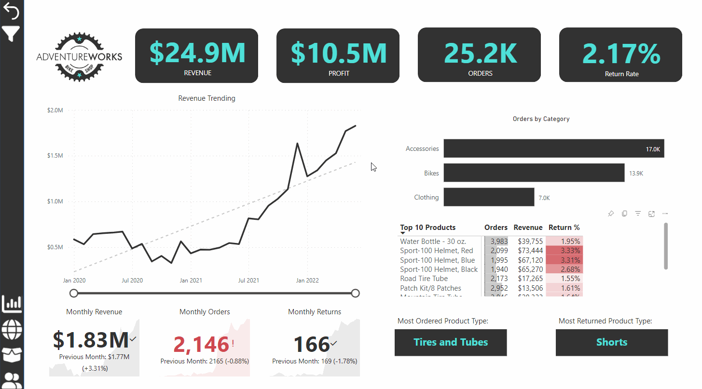

# AdventureWorks

A Microsoft Power BI business intelligence dashboard for AdventureWorks, a fictional global manufacturing company that produces cycling equipment and accessories.

The dataset was supplied with the [Maven Analytics Power BI Desktop course](https://mavenanalytics.io/course/microsoft-power-bi-desktop). This data was derived from the [AdventureWorks sample databases](https://learn.microsoft.com/en-us/sql/samples/adventureworks-install-configure) available from Microsoft.

The customer base is spread across 6 countries: Australia, Canada, France, Germany, United Kingdom and United States. Sales and return data is available for the period between 01/01/2020 and 30/06/2022. Customer profiles include date of birth, annual income, education level, number of children, occupation and homeowner status. 

## Features

- Track key performance indicators (KPIs) related to sales, revenue, profit, and returns.
- Compare performance across different regions.
- Analyse product-level trends.
- Identify high-value customers.

## Project Highlights

This project involved the following tasks:

- Connecting and transforming data 
- Building a relational data model
- Creating calculated columns and measures using **DAX**
- Created a rolling calendar using **PowerQuery M code**
- Building an interactive dashboard

## Dashboard Elements

#### Executive Summary View

- High-level KPIs for revenue, profit, orders and return rates
- Page-level filtering by product and product category
- Drill-through per product to product detail view

#### Map View

- Total orders per country

#### Product Detail View

- Per-product performance against order, revenue and profit targets
- "What if" analysis via price adjustment shows adjusted profit

#### Customer Detail View

- Total customer and per-customer revenue analysis

#### Custom UI Elements

- Filter pane for filtering by year and geography
- Custom tooltip for product category order metrics
